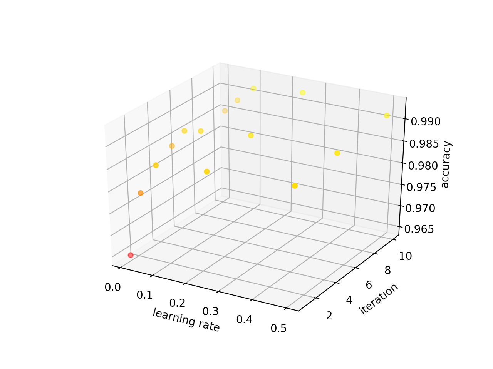

# malicious-url-detection

Logit Regression:
    Sigmoid function as activation function
    Use likelihood function to represent whole data set samples occurrence probability
    Choose maximum likelihood as cost function
    Calculate the derivative on weights
    Update weights by gradient ascent

Accuracy is 99% by average

